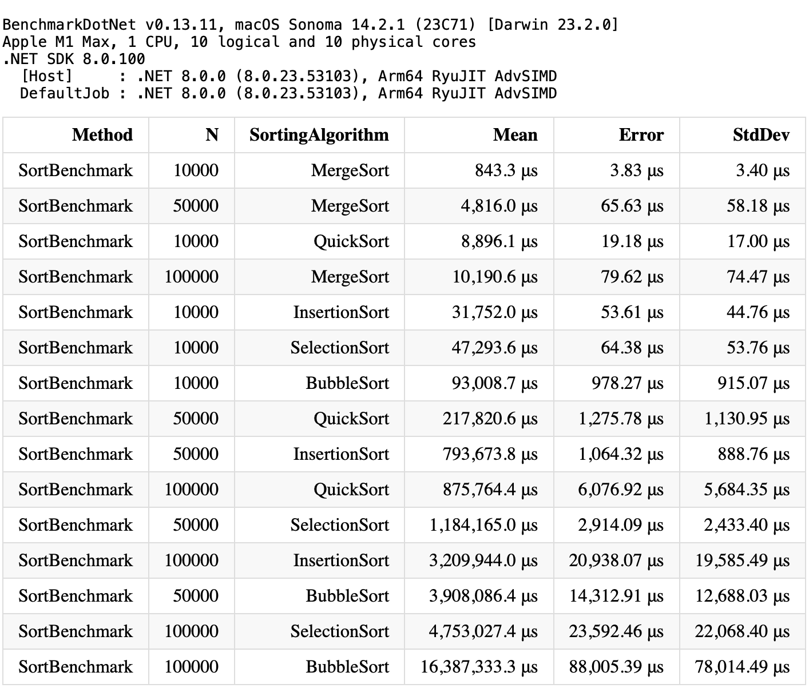

# Sorting API in .NET Core

This is a simple API built with .NET Core for sorting data with different algorithms.

## Getting Started

These instructions will get you a copy of the project up and running on your local machine for development and testing purposes.

### Prerequisites

What things you need to install the software and how to install them:

- [.NET Core SDK](https://dotnet.microsoft.com/download)

### Installing

A step by step series of examples that tell you how to get a development environment running:

1. Clone the repository.

2. Navigate to the project directory

```
cd sorting-api-dotnet-core
```

3. Restore packages

```
dotnet restore
```

4. Build the project

```
dotnet build
```

### Running the tests

```
dotnet test
```

### Running the application

To start the application, run:

```
dotnet run
```

### Benchmark results

For benchmarking, I used [BenchmarkDotNet](https://benchmarkdotnet.org/), a powerful .NET library for benchmarking.



### Performance Notes

For large sets of data, `mergeSort` tends to perform better than `quicksort`. This is due to the fact that `mergeSort` has a worst-case time complexity of O(n log n), which makes it more efficient for handling large data sets.
